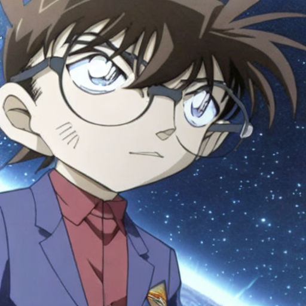

# ColossalAI-Dreambooth

- The model used in the experiment
- The dataset employed
- Parallel settings (if any)
- Instructions on how to run your code
- Experiment results, presented in a table or figure

This repo showcases an application of the ColossalAI framework combined with the Dreambooth method to finetune the Stable Diffusion model. The objective is to enable the generation of images depicting the character Conan from the popular anime "Detective Conan" in various contexts.

## Installation

To begin with, make sure your operating system has the cuda version suitable for this exciting training session, which is cuda11.6-11.8. Notice that you may want to make sure the module versions suitable for the whole environment. Before running the scripts, make sure to install the library's training dependencies:

```bash
pip install -r requirements.txt
```

### Install [colossalai](https://github.com/hpcaitech/ColossalAI.git)

```bash
pip install colossalai
```

**From source**

```bash
git clone https://github.com/hpcaitech/ColossalAI.git
python setup.py install
```

### CUDA and Pytorch

```bash
conda install pytorch==2.2.0 torchvision==0.17.0 torchaudio==2.2.0 pytorch-cuda=11.8 -c pytorch -c nvidia
```

## Model Setup

This project utilizes the [CompVis/stable-diffusion-v1-4](https://huggingface.co/CompVis/stable-diffusion-v1-4/tree/main) model. Before running the code, you should first download the model to your local machine. 

```bash
git lfs install
git clone https://huggingface.co/CompVis/stable-diffusion-v1-4
```

## Dataset and Prompt

This project leverages the Dream booth method, which is effective with only a small number of images. Accordingly, a concise set of just seven images of Conan, sourced from the internet, is used to fine-tune our model. These images are stored in the `conan` folder within this repository.

The instance prompt of the finetuning process is set as ``a photo of kudoshinichi``. You can modify the `instance_prompt` parameter in the `colossalai.sh` script. This parameter is key to directing the model's focus during dreambooth finetuning.

## Parallel Settings

The fine-tuning of our model was conducted on a single Nvidia A100 GPU, hence the parallel settings:

```bash
--nproc_per_node 1 --standalone
```

## Steps to Run the Code

### Finetune

1. Create conda environment and install all dependencies as indicated in Installation
2. Download the SD-V1.4 model to the folder: model
3. Create the finetuned weight output folder: weight_output and subfolders checkpoint-500, checkpoint-1000
4. Run ``module load cuda/11.8.0`` in your terminal and execute the bash script ``colossalai.sh``

### Inference

1. Modify the ``prompt`` variable in the ``inference.py`` file and ensure that the `prompt` variable aligns with the `instance_prompt` used during the finetuning phase.
2. Run ```python inference.py``` to generate test image. 

## Example Results

The `inference.py` script will generate two images:

1. output_original.png: generated by the SD-V1.4 model using the prompt without any finetuning on the weights. It serves as a baseline to compare the effects of fine-tuning.

   

2. output.png: produced by the model after it has been finetuned. This image showcases the model's enhanced capability to interpret and visualize the prompt in the context trained.

   
